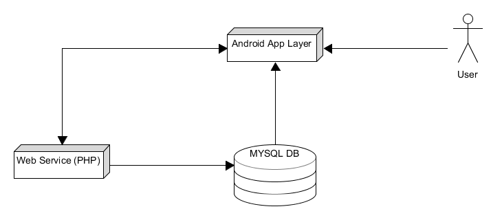
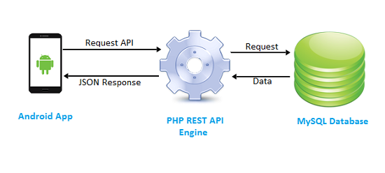
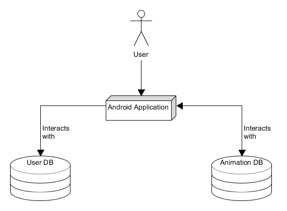
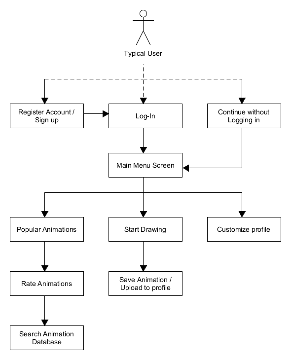
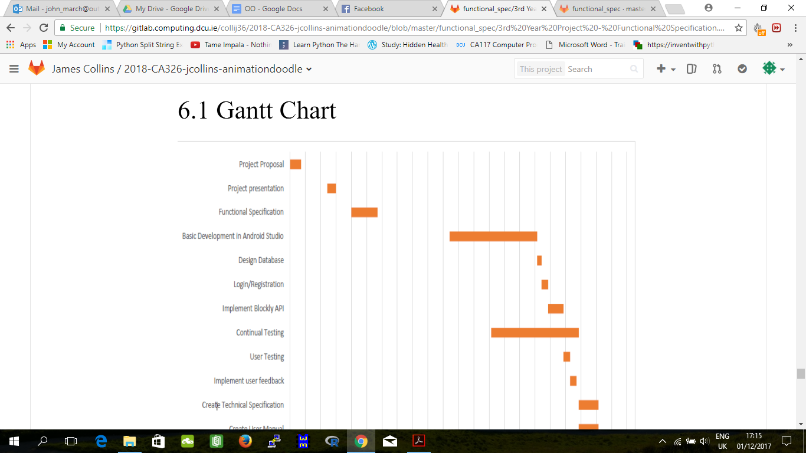

# Table of Contents

##### Page Content

##### 1. Introduction  
- 1.1 Overview  
- 1.2 Business View  
- 1.3 Glossary of Terms  

##### 2. General Description
- 2.1 Product / System Functions 
- 2.2 User Characteristics and Objectives 
- 2.3 Operational Scenarios 
- 2.4 Constraints 

##### 3. Functional Requirements
- 3.1 Start Drawing 
- 3.2 Sign up 
- 3.3 Create Profile 
- 3.4 Sign in 
- 3.5 Draw with Blockly 
- 3.6 Add drawing to animation 
- 3.7 Play animation 
- 3.8 Upload animations to database 
- 3.9 Rate animations 
- 3.10 Edit Profile 
- 3.11 Download animations to phone 
- 3.12 Search animation database 

##### 4. System Architecture
- 4.1 System Architecture Diagram 
- 4.2 Database Interaction Diagram 
- 4.3 Database Design Diagram 

##### 5. High-Level Design Diagrams
- 5.1 High-Level Design Diagram 
- 5.2 High-Level Design Description 

##### 6. Preliminary Schedule
- 6.1 Gantt Chart 
- 6.2 Critical tasks schedule 

##### 7. Appendices
- 7.1 Appendix – Resources


# 1 Introduction

# 1.1 Overview

Animation Doodle is a product being developed for Android mobile & tablet devices to
combine efforts of artistic design with animation. The application’s target audience is
primarily the younger generation. Children & Teenagers still in school can use this
application to explore their creative interests and learn about third-level topics like Animation
and Graphic Design. A basic understanding of programming & coding is also a fundamental
focus of the app through the Blockly API that google provides. This will be discussed later in

##### the specification.

The application, while fun to use, hopes to provide users with a basic understanding of how
animations can be created and hopes to inspire creativity among the youth. This application
is not exempt from older users as well. The applications main focus is user enjoyment &

##### retention time, if we can achieve that, this project will be a success.

In summary, the Application will allow users to create an account and sign up to our
applications user database. Doing so will allow users unique features such as uploading an
animation they created to our animation storage database, View your own profile, change

##### profile picture, view your created animations (MAX 3 - 5) which will be stored in your profile.

However, users do not have to sign-up to take advantage of ‘Animation Doodle’s’ secondary
features. Whether a user is signed-in or not, they can view other user’s Animations through
the ‘Uploaded Animations’ Tab or enter the canvas screen through the ‘Start Drawing’
button. This is where the bulk of the application’s content is found. In this screen a user can
draw an image in a variety of ways and add this image to an animation image timeline.
Special effects such as ‘Onion Layering’ or the ‘Frame-time offset’ will also be implemented

##### and will be discussed further below in section 2.2.


## 1.2 Business View

##### Product Selling Point:

##### As stated above the product will encompass topics of Animation, Design, Art & Coding.

The audience we believe the product will attract are younger generations. We feel children in
primary school or teenagers in secondary school will take the most out of this product. We
want to make the application as intuitive as possible without overloading the user with
information. Our prime goal is enjoyment and to solve that we’ll need to test a sample of

##### users prior to release.

The product might also be attractive for teachers wanting to teach their students about
programming. We plan to evolve the application so that users can animate their drawings
through using Google’s Blockly API. This involves layering bricks of pseudo-code on top of

##### one another and is a great stepping stone to the world of Computer Science.

##### Product Advertisement:

We plan to make this product have no financial-driven motives and do not plan to place
adverts in our product. Implementation of advertisements in our application may reduce the

##### total user base.


## 1.3 Glossary of Terms

###### • PHP:

##### Recursive acronym for PHP Hypertext Processor.

An open source, server-side, HTML embedded scripting language used to create dynamic

##### Web pages.

###### • MYSQL:

```
MYSQL is an open source RDBMS that relies on SQL for processing the data in the
```
##### database.

- Apache Server:

##### The Apache Web Server is a public domain, open source Web server.

- Onion-Layering:
    Onion-Layering is a 2D computer graphics term for a technique used in creating animated
    cartoons and editing movies to see several frames at once. This way, the animator or editor
    can make decisions on how to create or change an image based on the previous image in

##### the sequence.

- Frame-time Offset:
    A time-period between which each frame in the animation is played. This time-period can

##### be modified by the user between (0.0 - 5.0).

- Blockly API:

##### Google’s Blockly API to allow drawing & animation through code blocks.


# 2 General Description

## 2.1 Product/System functions

```
 Search animation database
o Allows users to search for animations using keywords or tags
```
```
 Edit Profile *
o User can make changes to their profile
```
```
 Add drawing to animation
o Allows user to add frame into an array of frames
```
```
 Play animation
o Allows the user to see their frames in motion
```
```
 Start Drawing canvas
o The UI for users to create their drawings
```
```
 Draw with Blockly
o Allow users to create drawings using block code instead of drawing tools
```
```
 Sign up
o Gives users the option to easily create a profile on app
```
```
 Create profile *
o Users can add their interests, bio, and store their animations
```
```
 Upload animations to database *
o Logged in users can allow other users to see their animations/drawings
```
```
 Rate animations *
o Logged in users can rate animations of other users
```
```
 Log in
o Allows users to log in using their username and password
```
```
 Download animation/images *
o Logged in users can download their animations to their phone from their
profile
```
##### * Features for registered users only


## 2.2 User Characteristics and Objectives

The user community can be broken down into two categories, users who have signed up to
the app and created a profile and those who have not. The logged in users will have access
to more features than regular users.
Users will be expected to have generally good technical expertise when it comes to using
apps. Due to our target audience we do not believe this to be a problem. Our design will be
closely modelled on other popular apps in order to make it as comfortable for the user as

##### possible. The app will be designed with a target audience of age between 8 - 24.

Our app will be accessible by anyone with a smartphone or tablet that runs on Android OS.
The user will need an internet connection to download the app, to access the Uploaded
Animations page, to login and sign up and also to edit their profile page. The user will be
able to create a drawing while offline and save them locally, or with an internet connection,

##### upload it to our animation database..

With our target audience in mind the user interface will be bright, friendly, fun and exciting in
order to gain a user's attention and retain their interest. An easy to use and accessible UI will
be expected by users, as well as a fast and reliable system.
Users will expect to be able to create detailed drawings using a variety of drawing tools such
as onion layers, re-sizeable pencils. The app must be “fool-proof” when users are adding
drawings to their array of frames in order to create their animation. Users shouldn’t have to
think about how to do this it should be intuitively done, by way of the app design.


## 2.3 Operational Scenarios

##### Unregistered user scenarios

##### User signs up

```
 A user will enter their name, email address and will then enter a password. The user
will also enter their username/nickname. They will then be directed to their empty
profile where they can continue to add details, such as a profile picture/avatar ,
animation interests, a quick bio.
```
##### Registered user scenarios

##### User signs in

```
 A user will select the login button on the app home screen. They will then be asked to
enter their username/email and their register password. Our system will check our
database to authenticate their details. If the user enters incorrect data then an error
message will be displayed. The user will have the option of entering their details
again or requesting a new password, which will be sent to their email address. If the
authentication is correct they will be brought to a page where there will be a “Start
Drawing” button and a “Profile” button.
```
##### Start Drawing

```
 The “Start Drawing” button will bring the user to a drawing canvas where they can
start drawing. At the bottom of the screen will display any previous frames they have
drawn.
```
##### View Profile

```
 Here the user will be able to view their profile details and also their saved animations
on the bottom their screen. Under each individual animation there will be an edit
button. This will allow you to edit your animations.
```
##### Edit Animations

```
 The user can now make changes to the selected animation. They can access each
frame of the animation and make alterations to it. When done the user simply saves
the changes and their animation will now be updated. A user will then see a button
labelled “Play Animation”.
```
##### Play Animation

```
 The animation will play on the screen. At the bottom of the screen will be a bar which
will include a play button.
```
##### Access Uploaded Animations

```
 The user is presented with 3 options: A ‘Popular Animations’ tab, ‘Newly added
Animations’ tab and ‘Your animations’ tab. Selecting either of the first two will result
in the user seeing a variety of animations from different users. ‘Your Animations’
displays your created animations. These Animations will be separated by genres.
When a user is saving an animation they will include tags, i.e sport, action, comedy.
A user can select and play these animations and then give them a rating if they
choose to do so.
```

##### Upload animation

```
 When a user has saved an animation, it will be stored on their profile. They will then
have the option to upload this to our database. Other users can now see this video
and give it a rating.
```
##### Draw with Blockly

```
 A logged in user can create drawings using Blockly. Blockly is a “ javaScript/android
library for creating visual block programming editors”. Users who are interested in
learning to code can use this feature to create drawings using blocks from a
“toolbox”.
```
```
On this page there will be a toolbox on the left hand side of the screen, from which
the user can manipulate the blocks to create drawings, which will appear on the
```
##### canvas in the middle of their screen.

##### Unregistered User

An unregistered user will have limited abilities using our app. They will be able to create
drawings and play animations and also view the Uploaded Animations page. They can only
save their created animations locally. No storage of non-registered user animations will be

##### saved on Animation Doodle’s database.

##### User accesses uploaded animations

```
 A user can see a variety of the highest rated animations. These videos will be
separated by genres. When a user is saving an animation they will include tags, E.G.
sport, action, comedy. A user can select and play these animations and then give
them a rating if they choose to do so.
```
##### Start Drawing

```
 The “Start Drawing” button will bring the user to a drawing canvas where they can
start drawing. At the bottom of the screen will display any previous frames they have
drawn.
```

## 2.4 Constraints

##### Time Constraints

Integrating the Blockly API into our app may take more time than we would have planned for.
As we haven’t used this API before, it is difficult to make a judgment on how long this

##### process may take.

##### Database Memory

As there is a limit on our MYSQL account, we will have to restrict how many animations each
user can upload to our database. We may also need to limit how much storage space each

##### user will have on their profile page, where they save their animations. (Max 3 animations)


# 3 Functional Requirements

## 3.1 Start Drawing

#### Description:

This is the main function of the app. All types of user will interact with and use this function,
regardless of whether they are a registered or unregistered type of user. The system must
provide users with an array of drawing tools, which can be monitored and changed, such as
adjustable pencil font, colour changes. The system should provide users with an easy to use
canvas on which to create simple/detailed drawings. There will be drawing tools on each
side of the screen and a blank white canvas in the middle of the screen. There will be an

##### array of frames on the bottom of the screen which will contain the user’s previous drawings.

#### Criticality:

As this is one of the main reason users will download and use this app, it is extremely critical
to the overall system. Users must not feel like they are limited in what they can achieve with

##### their drawings.

## 3.2 Sign up

#### Description:

This is a fundamental requirement for a user as it allows them to save and upload their
animations on the app. There will be a sign up screen which will allow the user to input their
username, email address and password. Their details will then be stored in our MySql

##### database which will be on an apache server.

#### Criticality:

This is essential to our system in order to allow users to save their animations. This
requirement will allow the system to store animations and drawings in their profile, using our

##### MySQL database.

#### Technical Issues:

We will use PHP to handle the form inputs, which will then be able to access our MYSQL
database.


### 3.3 Create Profile

#### Description:

After a user has completed the signup form successfully, our system will bring them to a
screen where they can create their profile. This will allow the user to add a short bio, an

##### avatar profile picture. This function will also display any saved animations the user creates.

#### Criticality:

Users will only continue to use the app if it is easy for them to be able to save, edit, play and
upload their animations and drawings. The system must make the profile page easily

##### accessible for the users to reach.

#### Technical Issues:

When a user has completed this process, our MySQL database will be updated with an entry
for this users profile details. The users entered information will be allocated to the associated

##### table in our database.

#### Dependencies:

##### This is dependent on the user having completed the signup requirement.

### 3.4 Sign in

#### Description:

This allows a user to gain access to their profile. A user will input their username and
password, which will then be checked with our MySQL database. If their details are correct

##### they will be granted access to their profile.

#### Criticality:

This is essential in allowing our system to authenticate and isolate users. It allows our

##### system to separate users and upload the correct profile page for that user.

#### Technical Issues:

We have to ensure that each login is unique and stored in our database correctly, to ensure

##### that there are no duplicate usernames.

#### Dependencies:

##### This requirement depends on the user registering on the app first.


### 3.5 Draw with Blockly

#### Description:

This requirement will allow users to create drawings using Google’s Blockly API. The system
will replace drawing tools with a menu of blocks. Blockly will give the system the ability to
represents coding concepts as interlocking blocks. A user can then create simple drawings
by interacting with the blocks. As the blocks are being formed by the users, our system will

##### create the resulting drawing on the screen.

#### Criticality:

This requirement is one of our system’s USP (Unique Selling Point). For that reason it is
imperative that the system allows users to create drawings while also learning the basic

##### principles of coding.

#### Technical Issues:

The main issue here is to ensure that the Blockly editor is kept separate from the normal

##### drawing feature. These two functions cannot be and should not be integrated.

### 3.6 Add drawing to animation

#### Description:

This function allows users to add a drawing into an array of frames. The array of frames will
create the animation. Our system will give the user the option to add a drawing, at a specific

##### position/index to the array at the bottom of the screen.

#### Criticality:

This will have a huge bearing on whether a user will be satisfied with the system. The
process of adding a drawing should be extremely easy, with no hassle or train of thought

##### involved.

### 3.7 Play animation

#### Description:

Provides users the option to turn their drawings into a Stop Motion Animation. Our system
will run each frame/drawing that the user has added to their animation/array consecutively.
The user will press the play button at the bottom of the screen. The animation will loop a

##### number of times. There will also be a pause and stop button beside the play button.

#### Criticality:

The main reason users will use our app. Any problems or reliability issues will mean losing
users permanently. This function should fulfil a user’s expectation and be very similar to how

##### they would normally interact with a video on the YouTube.

#### Dependencies:

##### A user will only be able to play an animation that consists of at least 2 drawings/frames.


### 3.8 Upload animations to database

#### Description:

This function allows the user to upload their animations to our Uploaded Animation page.
When this function is used, our system will add the animation to our database. The
animation will then be extracted from the database and displayed on the uploaded

##### animations page.

#### Criticality:

This requirement isn’t essential but it allows users an opportunity to interact with each other

##### through their shared animations.

### 3.9 Rate animations

#### Description

A user has the ability to rate an animation on a scale of 1-5, using this functional
requirement. Each animation on our uploaded animation page will have an average rating
located underneath it. We will use our MySQL database to store the ratings for each

##### animation.

#### Criticality:

This feature is not critical to our system. It is a nice added feature which will encourage

##### users to return to our app on a regular basis.

#### Technical Issues:

As mentioned before, the ratings will be stored in each user_animation table in our

##### database. Our database will be automatically updated when a user gives it a rating.

#### Dependencies:

##### Both logged in users and unregistered users can rate animations

### 3.10 Edit Profile

#### Description:

A user can make changes to their profile after they have initially created it. Our system will
allow the user to edit their information stored on their profile page. Our MySQL database will

##### subsequently be updated with these changes.

#### Criticality:

This is simply an added feature to satisfy a user's optional needs. It is not critical to our

##### system.

#### Technical Issues:

##### We will use a PHP script to carry out this requirement.

#### Dependencies:

##### A user must have signed up and created a profile in order to use this function.

### 3.11 Download animations to phone

#### Description:

##### This function allows a user to download an animation from the app to their android device.

#### Criticality:

As we will have to place a limit on the amount of storage space each user profile has, this
requirement is extremely critical. A user will only be allowed to store between 3-5 animations
on their profile page, so in order to allow them to overcome this, they need to be able to save

##### their animations to their phone.

#### Technical Issues:

Our system will convert the animations to video files when being uploaded to our database.
This will make it simpler for our system to allow users to download their animation to their

##### device

### 3.12 Search animation database

#### Description:

This function allows any type of user to search our database of uploaded animations. Using

##### keywords or tags, users can specify the types of animations they would like to view.

#### Criticality:

This feature is not critical to the overall system. It simply makes it a little easier for users to

##### view the exact type of animations they would like displayed.

#### Technical Issues:

##### This requirement will use PHP forms to query the database for the specified search criteria.


# 4 System Architecture

#### 4.1 Basic System Architecture Diagram



##### Android Application Layer:

Fig 4.1 above shows the architecture of the project and how all the functionality works
together. The Android Application Layer is what the user views and interacts with. It is the
front-end of the project. The user will interact with our GUI interface setup using android
studio & make GET requests to our Database.

#### 4.2 Database Interaction Diagram



Users that want to upload their drawn animations to our MySQL Database or view other
user’s animations through our ‘Uploaded Animations’ tab will require access to our Database
hierarchy. We can do this intelligently using the REST API. Users can make a ‘GET’ or
‘POST’ request to query our database & REST responds in JSON formatting. It is logical to
say that this element of the architecture acts as a bridge between the other parts of the

##### architecture, specifically for inserting and retrieving information to and from the database


The primary reasons for utilising the REST API is security / abstraction, efficiency,
robustness. REST is also technologically agnostic. So if we ever decided to implement the
application on IOS or any other system, we wouldn’t have to change the database structure

##### and querying techniques because of its interoperability.

#### 4.3 Database Design Diagram



Database design is an essential element of our project. We want to design our database so
to store animations (Converted to video files) that can be retrieved when needed. When
viewing the ‘Uploaded Animations’ tab, user’s will be able to view other user’s created
animations. This data will be stored in one of two of our database structures, our ‘Animation
database’.
So what the user sees through the application is actually information stored in our database,

##### retrieved using PHP scripts within the REST API.

We intend to also have another database known as our ‘User Database’. This is where user
credentials & profile details will be contained. There will need to be some link between both
of these databases to map a given user to a set of animations they have created. This
should be easy to implement in relational database as such.


# 5 High-Level Design

#### 5.1 High-Level Design Diagram



##### Fig 5.


#### 5.2 High-Level Design Description

#### Fig 5.1 is explained below.

```
 Stage 1: Register / Sign Up:
```
##### Unregistered users can create an account with ‘Animation Doodle’ and then will be

##### redirected back to the login screen..

```
Alternatively, users can continue without an account, however some features will not
```
##### be available

```
 Stage 2: Login:
```
##### With a username & password, users can now login to our system and have access

##### To all available features (E.G. uploading animations).

```
 Stage 3: Start Drawing:
This screen is where animation creation is done. Users can draw a frame, add this
frame to the time-line of frames and when complete, users can preview the animation
by pushing the ‘Play’ Icon, symbolised by a play button. User’s will have a basic
```
##### selection of tools to draw with E.G. a pen, paint-brush, pencil, paint roller.

```
The drawing utensils thickness can also be adjusted. Between each frame will be a
time offset, as to when the next frame should be played in sequence. This can be
adjusted to the users liking. We plan to also implement an ‘Onion Layering’ effect so
```
##### users can see their previous frame and adapt it accordingly.

```
Users can also create animations using Google’s Blockly API which will allow users
to take a drawn element and animate it through blocks of code. This feature is quite a
```
##### challenge to us as a team but we will try to implement it correctly.

```
Completed animations can be then saved locally, or uploaded to the user’s profile
(Non-registered users will not have access to this feature). A maximum of 3
```
##### animations can be stored on a user’s profile.

```
 Stage 4: Customize user profile:
```
##### Users can choose a default avatar profile icon and give a description about

##### themselves in our ‘Bio’ section.

Beneath the ‘Bio’ section, users can find 3 empty slots where animations can be

##### uploaded to and viewed by the public. Only through the ‘Start Drawing’ screen can

##### New animations be uploaded.

Once a user uploads an animation, one of these 3 slots will be filled with a frame
from the animation. Pushing the slot-icon with your finger or stylus will open the

##### animation in a separate screen & play the animation to view.

```
 Stage 5: Popular Animations:
```
##### This screen will display a list of users & animation tupled together into rows. E.G.

##### [ UserName ---- Animation Title ---- Genre ---- Date uploaded ---- Rating ]

##### Users can view other user’s animations.


```
 Stage 6: Rating Animations:
```
##### Only Registered & Logged in users can rate other people’s animations.

Users can rate animations by selecting the specific row they choose and provide a

##### rating in the form of 1 - 5 stars. Highly rated animations will be displayed at the top.

```
 Stage 7: Search Animation Database:
```
##### There will be a ‘magnifying glass’ icon which when pressed will bring up an input box.

Users can enter an animation title E.G. ‘Cowboys at war’ to search for and match

##### with an animation in our animation database.

Users can also specify to search for a user by augmenting the search from
‘Animations’ to ‘Users’ E.G. ‘MikeJ52’ - This will display all of that specific user’s

##### animations in a row by row format.

 Stage 8: Log-out:
Once finished using our application, users can log out. This signs-off the user from

##### our system and closes the application on their device.


# 6 Preliminary Schedule

## 6.1 Gantt Chart



## 6.2 Critical Tasks

#### Task Name Start Date Duration

##### Project Proposal 20/10/2017 5 days

##### Project presentation 06/11/2017  4 days

##### Functional Specification 06/11/2017 12 days

##### Basic Development in Android Studio 01/01/2018 40 days

##### Design Database 10/02/2018 2 days

##### Login/Registration 12/02/ 3 days

##### Implement Blockly API 15/02/2018 7 days

##### Continual Testing 20/01/2018  40 days


##### User Testing 22/02/2018 3 days

##### Implement user feedback 25/02/2018 3 days

##### Create Technical Specification 01/03/2018 9 days

##### Create User Manual 01/03/2018 9 days


# 7 Appendices

Section Appendices

7.1 Appendix 1 – Resources

###### • https://developers.google.com/blockly/  

###### • https://developer.android.com/training/animation/index.html  

###### • https://en.wikipedia.org/wiki/Onion_skinning  

###### • http://www.php.net  

###### • http://www.w3cschools.com  

###### • http://www.devshed.com  

###### • http://www.sqlcourse.com  

###### • http://www.mysql.com  

###### • https://developer.android.com/studio/index.html  

###### • http://www.computing.dcu.ie/~cdaly/  

###### • https://gitlab.computing.dcu.ie  
