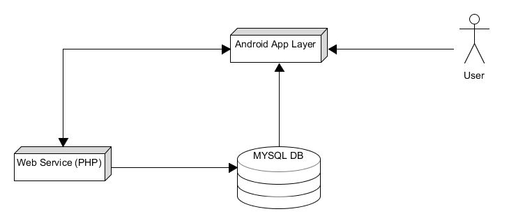
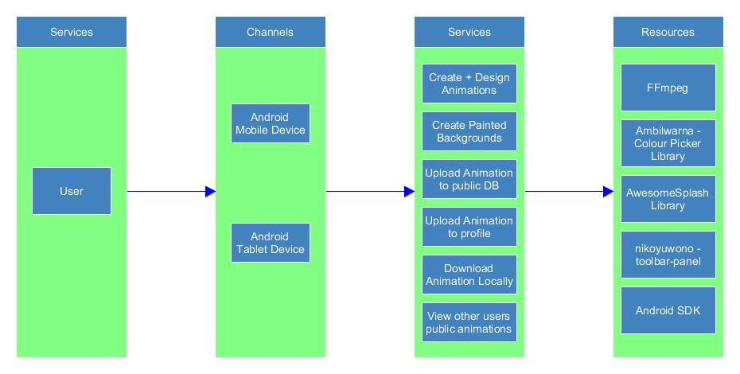
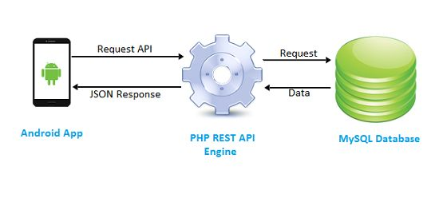
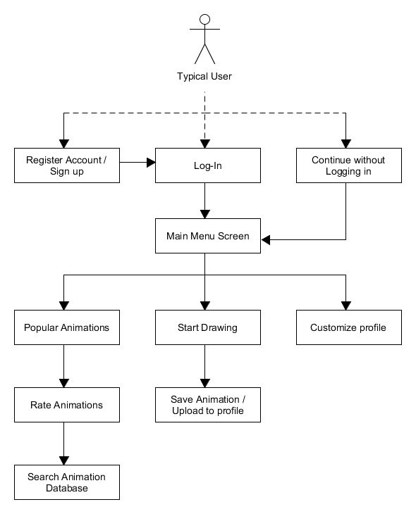
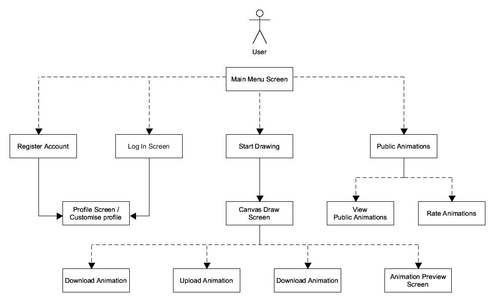
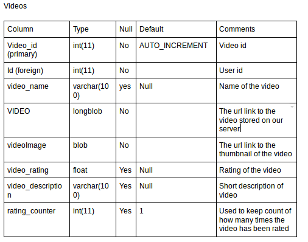
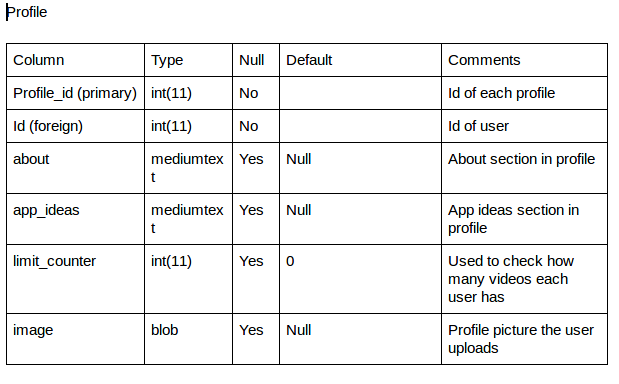
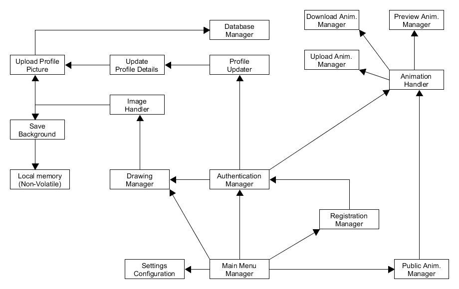

## Technical Specification


## Animation Doodle

**By: Shane Creedon & James Collins**

## Table of contents

**1 - Introduction**

 - 1.1 Overview

 -  1.2 Glossary

**2 - System Architectural Overview**

 - 2.1. System Overview

 -  2.2. Architectural Overview

 -  2.3. System Components

**3 - High Level Design**

 - 3.1. High-Level Design (Old)

 - 3.2. High-Level Design (New)

 - 3.3 Data Dictionaries

 - 3.4. Component Model


**4. Problems and Resolution**

 -  4.1. Registration Bug

 - 4.2. Video Title Spaces bug

 - 4.3. Bottom Navigation bar disabled functionality

 - 4.4. Overwriting final frame in timeline bug

 - 4.5. All drawn pathways incorrectly change colour bug

 - 4.6. Extremely inefficient and slow library usage

 - 5. Installation guide

 - 5.1. How to Install from GitLab

 - 5.2. How to Install when available on Google Play Store

**6. Resources**

# Technical Manual - Animation Doodle

## 1 - Introduction

### 1.1 - Overview

Animation Doodle is an android application which encompasses both elements of
artistic design and animation creativity. The application allows a given user to use their finger or a stylus to draw on the canvas and animate. We based the project off the idea of flip notes and how people could make the drawings look like they are moving. We wanted to target a younger generation for this app seeing as our system will have a basic set of features compared to some other app’s on the marketplace but will be a lot more user-friendly. 


The application also allows users to register/sign-in and customise their own profile screen. Not only this, but users can also view & rate other users animations that they have uploaded to our database,

The application has been designed to be extremely user-friendly and following the
design principles from the Material Design guidelines. The initial design and
conceptual structure of the project followed that a typical user would log-in to our system and then they could draw & animate and access other features like
customising their profile, viewing other public animations or uploading their own
animations. However, as the project continued, we became increasingly aware of
how an android application should be structured and crafted. Thus, we decided to
move the preventative barrier to the core content of the application, that barrier being the log-in screen. In the applications current state, users can create animations without ever needing to make an account and log-in. However, it is advantageous to do so as they would unlock features such as:

 - 1. Storing animations in their profile (5 max)

 - 2. Rating other user’s animations on the public animations tab

‘Animation Doodle’ is an application targeting a younger audience, enabling them to draw and animate and explore their own creative interests at an early age. This is one of our end goals and we want to keep improving the app for this purpose.

### 1.2 - Glossary

 -  Onion-Layering:
    
    Onion-Layering is a 2D computer graphics term for a technique used in
    creating animated cartoons and editing movies to see one or more frames at
    once. This way, the animator or editor can make decisions on how to create
    or change an image based on the previous image in the sequence.

 - Frame-time Offset:

   A time-period between which each frame in the animation is played.
   This time-period can be modified by the user between (1 - 30 FPS).

 - MYSQL:

   MYSQL is an open source RDBMS that relies on SQL for processing the data
   in the database.

 - API (Applicable Programmable Interface):

   API is the acronym for Application Programming Interface, which is a software
   intermediary that allows two applications to talk to each other.


 -  Thread
    Animation Doodle is a multi-threaded application. A thread is a single sequential flow of control within a program.

 - Asynchronous

   When the programs current task does not wait for another another task to
   complete before executing it. In this way, the current task may finish before or after the other task.

 - Bitmap

   A bitmap (or ​raster graphic​) is a ​digital​ image composed of a ​matrix​ of dots.When viewed at 100%, each dot corresponds to an individual ​pixel​ on a display. In a standard bitmap image, each dot can be assigned a different color. Together, these dots can be used to represent any type of rectangular picture​.

---

## 2 - System Architecture / Architecture overview

### 2.1 - System Architecture





This is our original system architecture model. It shows the flow of information among the various properties of our system. Our android app interacts with our MYSQL database through PHP. This is an essential property to our system given we must store both user
details, user images and user animations. Our system architecture (for the most part) has stayed consistent in its design from the conceptual stages several months ago.

**User**

The user in this scenario is the client or individual running our mobile application and
interacting with the various services it provides. Our application is targeted towards devices
with an SDK of 23, however we have taken the necessary precautions to ensure it is
compatible with devices with SDKs of 19+ (4.4 KitKat)

**PHP service**

Within our mobile application, we use PHP to both enable a connection to our external
database as well as query and update it accordingly in coordination with the user.

**Database**

The database system we required had to be sufficiently large to ensure there would be
enough space to hold user details, images, and the largest of the bunch: video files.
Generally the video files would not be too large in consideration as we are able to compress
them before uploading them to the database while maintaining a decent frame quality.


### 2.2 - Architectural Overview Diagram



The Architectural Overview diagram is an important diagram to show the key architectural
model of a system. The above diagram is the architectural overview diagram of Animation
Doodle and how exactly each of the columns interact with one another. We have a user who
can interact with our android application in two ways: Through mobile or tablet systems.

These systems then interact with the many available services offered by Animation Doodle.
Many of those key services are listed above. Resources are the external entities / libraries /
APIs that the services interact with. For example: FFmpeg is a key service which takes the
array of bitmap images the user has drawn and converts them to a MP4 video file.
(Download Functionality).


### 2.3 - System Components





The above diagram is our old conceptual model. Our current model takes a similar approach
but does not take advantage of the PHP Rest API. We simply query the database through using PHP and receive and parse the JSON response accordingly.


## 3 - High Level Design

### 3.1 - Original High Level Design Diagram





The design flow of this diagram is very simple to follow. The dotted arrows indicate a choice among entities and no absolute deterministic outcome. The original high level model was quickly revamped early into development when our project coordinator suggested we do not force the user to log in to utilise the apps main features.

Instead, we let the user access the core functionality of the application but restrict some features involving database interaction to non-logged in users. This is exposed to a greater extent in the component model further down.

### 3.2 - Current High Level Design Diagram




This is our current High Level Design Diagram. As you can see, a user does not need to log in to access the core functionality. Users upon simply launching the app can draw / animate, register / sign-in or even view public animations. They can Download their own animations locally but some features cannot be accessed as expressed above such as:

 - 1. Uploading an Animation

 -  2. Rating other user’s Animations


### 3.3 - Data Dictionaries

The following tables illustrate how the entities in our system relate and interact with each
other.

The user table stores information about each user that register an account on the app.

When the user signs up there email and password are stored in the table and they are
assigned a unique id. This id is used to link users to their videos and also to their profile
screen.

The videos table stores the links to each video and also a thumbnail image of the video.
Each video has attributes which contain video name, video link (a link to the video stored on
our server) , image link (a link to the image stored on our server), a rating, a rating counter
and a description. Each video uploaded also has a user id key with it, in order to link it to the
users profile. Each video has a unique identifier, and has a M:1 relationship with user. Each
user can have multiple videos. Only links to video and image files are stored in the table to
reduce the load on our database and improve efficiency.

Each user that registers is given a profile screen. This data is stored in the profile table. The
table has attribute profile id, image link (for profile picture) and an about and ideas section.
Each profile is linked to a user by the foreign key `user` id. There is a 1:1 relationship
between profile and user.


---



---



---


### 3.4 - Component Model





‘Animation Doodle’s component model is showcased above. It shows the key
interactions between each of the components within our system.
From the ‘Main Menu Manager’ which is shown after the app launches, the user can
take advantage of a multitude of components:

 - 1. Users can adjust the settings through the ‘Settings configuration

 - 2. Users can access the public animations tab for viewing and other features
     depending if they are authenticated (logged in).

 - 3. Users can register or sign-in

 -  4. Users can directly go to the canvas screen to animate and draw through the
    Drawing Manager.

We have special components which handle individual things to boost efficiency and
effectiveness. For example:

 - 1. The Image Handler is a specialised component only responsible for image related operations. Examples include: Saving a background frame locally or uploading a profile picture to a users profile page.

 - 2. Animation Handler is one of the most important components, if not the most
 important component on the entire model. This component is accessed from
 multiple sources (Public Animations / Preview Screen) and is essentially the
manager for all the animation functionality built into the application. Downloading animations locally / converting your animation to an MP4 file and saving it.
Uploading your animations to our database, and of course actually previewing
your animation in creation or viewing publicly are all functions the Animation
Handler deals with.

### Managing Animations

#### Download Animation

When a user selects the download animation button in the drawing screen (representing by
a typical download icon) the application calls an asynchronous task to convert all the bitmap
frames to JPEGs. These are stored in the Temp directory in AnimationDoodle/Temp.
Another asynchronous task is then called on completion of the frame task to convert all the
JPEG images in the Temp directory to video (MP4). AnimationDoodle makes use of the
FFmpeg library to convert all these JPEGs to video and then stores the video in
AnimationDoodle/Animations. All the JPEG images stored in Temp are then removed since
the video has been generated.

#### Preview Animation

A user is brought to a new activity where the array of pathways (Frames) are subsequently
shown based on a frame-rate (adjustable by user). This preview screen showcases a title
bar and a bottom toolbar. The title bar shows the animations name and the bottom toolbar
has a play/pause button, a SeekBar indicating which frame the user is on and the duration of
the animation, and finally an ImageButton. When this ImageButton is clicked a user is
offered to change their background to one of four options.

 - 1. Blank Canvas
 - 2. Crumpled Paper
 - 3. Ancient Scroll
 - 4. School Paper
These 4 items just add a bit of variety to our app and make it more interesting to view your
animations on different backgrounds.


#### Upload Animation

Once a user has completed their animation, they can upload this to our database for storage
reasons and for public acknowledgement. Once the user selects the upload button, they are
first checked to see if they are indeed logged in and have a profile. If they do, they are
prompted with which video from their animations they wish to upload. Once selected, that
animation is then brought to an synchronous activity where the database is updated through
a PHP script on our server. A JSON response will be returned indicating whether or not the
animation has been successfully uploaded or not.

### Handling Images

#### Download Background

When a user has drawn a frame or switched to a previously drawn frame, they can choose
to save that frame and reuse it later as a background for an animation. Doing so would save
the animation to AnimationDoodle/Backgrounds. To be more technical. The system looks at
the current frame the user is on and converts that frame to a bitmap and then compresses it
to a JPEG.

#### Set Background

Users can set the background for the entire duration of an animation during creation of it
through the ‘Set Background’ button. User’s will be prompted to import an image from their
gallery / pictures / google drive to use as a background in the animation. Once imported,
backgrounds can be easily removed by clicking the same button. Imported images are
reverted to a bitmap and are then placed in the background of the canvas.

#### Upload Profile Picture

Users, once signed-in can upload an image as their profile picture. This image is simply
changing the image src of the imageView but once uploaded this image is sent to the
database and stored in that particular accounts row in the profile table. In this way, if the
user logs out or closes the app, the profile image will remain.


## 4 - ​ Problems and Resolution

#### 4.1 - Registration Bug

Registration bug where user data was being inserted twice when they hit the enter key to
submit their input. Fixed it by changing the return statement in the onClick code

#### 4.2 - Video Title Spaces bug

Spaces in video titles was causing issues with playing videos on phones. Fixed it by
replacing the spaces with %20.

#### 4.3 - Bottom Navigation bar disabled functionality

Bottom Navigation Main Menu would swap between fragments as expected but any
interactive properties on that fragment would not work. (We needed to move some
functionality into the fragments)

#### 4.4 - Overwriting final frame in timeline bug

(Early in development) When you clicked play_animation, the frame the user exited the
play_animation_screen would overwrite the last frame in the animation.

#### 4.5 - All drawn pathways incorrectly change colour bug

Change Colour would change the all the pathways on that frame to that colour and not the
pathways drawn afterwards only.

#### 4.6 - Extremely inefficient and slow library usage

Download Animation → We used the JCodec Library initially and we did it on the main
thread. Doing such an intensive process on the main thread caused us to drop many frames.
We moved the process to an additional Asynchronous thread. But the library was still far too
slow at encoding the frames to a video format (.mp4). We were struggling with this for a few
days and eventually through constant research we dramatically increased the download
speed using a different library yet much more complex called FFmpeg.


## 5 - ​ Installation Guide

### 5.1 - Install the application from GitLab

```
 - Install Android Studio if not already.
 - Open Android Studio accordingly.
 - Create & Start your emulator. This can be done by:
   - ○ > Open Tools
   - ○ > Android
   - ○ > AVD Manager
   - ○ > Create Virtual Device
 - Alternatively, you can connect your phone through a USB connection rather than
open an emulator and continue on.
 -  Download the APK file linked to here on GitLab:
https://gitlab.computing.dcu.ie/collij36/2018-CA326-jcollins-animationdoodle/blob/master/code/app/app-release.apk
 - Start Windows CMD and go to android-sdk/platform-tools directory
 -  Paste your APK file here
 - Type the following command: adb install <APK PATH>
 - E.G. adb install C:\Users\Shane\AnimationDoodle\example.apk
```
### 5.2 - Install from Google Play Store

```
 - Open the Play Store and search for ‘Animation Doodle’
 - Select Animation Doodle and install it
 - A permission dialog box may be prompted, accept it.
 - The Application will begin to download
 - Once downloaded the application can be found on the app screen or in the
notification tray at the top of your devices screen.
 - Enjoy!
```

## 6 - Resources / Libraries

 -  Awesome Splash Animation Introduction
(​https://github.com/ViksaaSkool/AwesomeSplash)

 -  Marker SeekerBar
(​https://github.com/bq/MarkerSeekBar​)

 - Writing Minds FFmpeg Library
​ ( ​ https://ffmpeg.org/ffmpeg.html)

 - Bottom Dialog Material Design Navigation Bar
​ ( ​ https://github.com/javiersantos/BottomDialogs)

 -  Nice Dialog Box Library
(​https://github.com/javiersantos/MaterialStyledDialogs​)

 -  Fancy Gif Dialog Box Library
(​https://github.com/Shashank02051997/FancyGifDialog-Android​)

 - Library to allow choice of paint colour
(​https://github.com/yukuku/ambilwarna​)

 - Library to allow circular profile pictures
(​https://github.com/hdodenhof/CircleImageView​)
