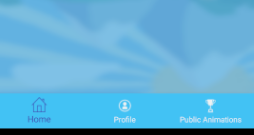
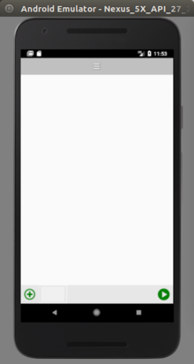
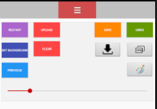
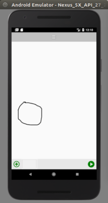
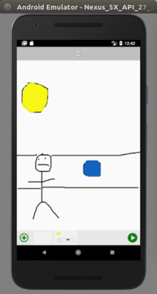
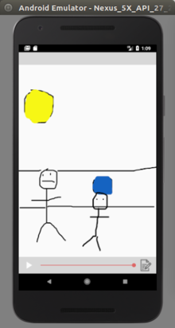
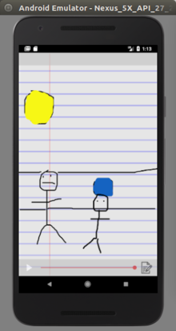

## USER MANUAL
---

---

**Table of Contents**

**1. About Animation Doodle**

**2. Get Started**
   -    Installation
   -    Registration
   -    Login
   -    View Profile

**3. Start Drawing**
  -    Start Drawing
  -    Menu bar
  -    Change Paint Colour
   -   Previous Frame
   -   Undo
   -   Clear
   -   Add Frame
    -  Save Background
    -  Set Background
    -  Restart Animation
    -  Save Animation
    -  Upload Animation
    -  Increase Frame Rate Speed
    -  Play Animation

**4. Play Animation**
   -   Change background

**5. Public Animations**
   -  View Animations
   -  Rate Animations

**6. Settings**
   - Change Settings

**7. Logout**
  - Logout

**1. About Animation Doodle**

This is the user manual for our animation app “Animation Doodle”. Animation Doodle is an
application that unites both drawing and artistic design with animation inside an android
mobile application.

**2. Get Started**

*Installation*

 - Go to the Google Play Store and search for Animation Doodle

 - Click on the Animation Doodle icon

 - Click on the install button

 - Once the app is installed you will then be able to open it on your phone

*Registration (Optional)*

 - To register on the app, click on the profile icon in the menu bar visible in the home
screen, sign-in screen & public animations screen. This will bring you to the login
screen. You then click the register button on that page.

  - You will then enter a valid email address and a password. In order for a password to
be valid it must contain at least one upper case character and at least one numeric
character.

  - If you enter an invalid email address or invalid password you will receive information
about how to correct it. Please see an example below

  - After entering valid details you will be successfully registered and brought to your
profile page.

*Login*

  - To login you will enter the email address and password you have previously used to
register an account on the app.

 -  Upon a successful login you will be brought to your profile page

*View Profile*

 -  Click on the profile icon on the menu bar at the bottom of the page

 - On your profile screen you will be able to change your profile picture
 - Edit About and Anime ideas section
 - View your uploaded animations at the bottom of the screen

**3. Start Drawing**

*Start Drawing*

 - On the main home page click the “Draw on Canvas Button”. This will bring you to a
blank drawing canvas.

 - In order to start drawing simply move your finger or stylus around the blank canvas to
draw.

*Menu Bar*

 - There are multiple features which you can use to assist you in creating your
animations.

*Change Paint Colour*

 - In the menu bar at the top of the screen, click the paint button

 - Then choose from the selection of colours to change the colour of the paint brush. See example photo below

*Undo*

 - To erase a mistake from a drawing, press the undo button.

 - This will erase the last part of the drawing, as seen below.

*Before undo*                     | *After undo*
:-------------------------------------:|:--------------------------------------:
        |  

*Clear*

 -  To remove a drawing from the canvas you press the clear button. This removes all
drawings on the canvas.

*Before clear*                     | *After clear*
:-------------------------------------:|:--------------------------------------:
        |  

*Add Frame*

 - To add another drawing frame to your animation simple click the add button

*Previous Frame*

 - To duplicate a previous frame and add it to a new frame, click the previous frame
button form the menu bar.

*1st frame*                     | *2nd frame*
:-------------------------------------:|:--------------------------------------:
        |  

*Save and Set Background*

 - The save background feature allows you to save a drawing to your phone’s memory.

 - You can then use this background as part of any animation by using the set
background button, found in the menu bar.

*Restart Animation*

 - Removes all frames on the timeline and allows the user to start a new animation
project. A prompt dialog is initially proposed to ensure the user definitely wants to
restart the animation and did not click the button by mistake. Once accepted, a new
dialog alerts asking the user to enter a new animation project title.

*Save Animation*

 - Convert the animation to a video file and downloads to the users phone.

*Upload Animation*

 - Uploads the animation to the app’s database. The animation is then visible in the
users profile & the public animations tab.

*Adjust Frame Rate Speed*

 - Increases or decreases the speed at which an animation plays

*Play Animation*

 - Brings the user to our Play Animation Screen

**4. Play Animation**

*Play Animation*

 - Plays the animation created by the user

*Change Background*
 
 - This allows the user to select a different background on which the animation is played

 - There a number of different backgrounds to be selected

*School Paper background*                     | *Crumpled Paper background*
:-------------------------------------:|:--------------------------------------:
        |  

### Example Animation:

**5. Public Animations**

*View Animations*

 - To view other users animations, click the public animations button located at the
bottom right of the menu bar in the home screen.

 - The public animations screen will then load with the most popular animations and
their ratings

 - To play the animation, click the video thumbnail

*Rate Animations*

 - To give an animation a rating, use the rating bar at the bottom of each video and
press the Star icon to submit your rating of that animation.

**6. Settings**

*Change onion skinning on/off*

 - While on the home screen, a user can choose to turn off the onion skinning feature. By default, this feature is turned on.

**7. Logout**

*Logout*

 - To logout, go to the profile screen
 - Click on the menu button in the top right of the screen, and select log out.
 - You will then be redirected to the home page.
